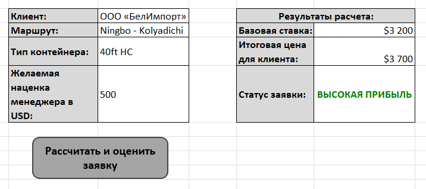

# Automated Freight Quotation & Client Lead Scoring Tool (Excel VBA + MySQL)

## Project Overview
An interactive, automated workstation developed for Sales Managers and Freight Forwarders to instantly calculate container freight rates and evaluate lead profitability. This tool bridges the gap between raw corporate data and customer-facing sales by replacing manual rate lookups with a single-click automation process.

[Download Freight_Quotation_Tool (.xlsm)](./Freight_Quotation_Tool.xlsm) 

## Business Automation Value
Manual quotation workflows typically cost freight forwarders 15–20 minutes per inquiry, leading to human calculation errors and delayed customer responses. This tool slashes quotation times to **under 0.1 seconds**, automatically validates input parameters, scores deal margins, and exports a clean, secure PDF contract-offer directly to the desktop.

## Technical Architecture & Backend Integration
* **Data Source Layer:** Rates are securely hosted on a central MySQL database (`freight_tariffs`), decoupling commercial pricing from individual localized Excel files for enhanced corporate security.
* **Data Integration (ODBC DSN Architecture):** Excel VBA establishes a direct network handshake with MySQL via a pre-configured System Data Source Name (DSN), rendering the macro robust against software bitness/version mismatches.
* **Data Validation:** Form cells use strict data validation drop-down menus to eliminate spelling mistakes or invalid port queries.

## Core Macro Logic & Data Masking
1. **Extraction:** VBA captures user inputs (Route, Container Type, Desired Margin) and executes a dynamically generated SQL query to fetch base costs.
2. **Scoring Logic:** Implements automated margin validation: margins $\ge$ $500 prompt a green "ВЫСОКАЯ ПРИБЫЛЬ" status, while lower margins alert the user in red.

  

   
4. **Data Masking & Privacy Protection:** To prevent the accidental disclosure of internal company margins or base costs, the export script uses array targeting to isolate and print **only the final customer price ($3,700)**, ensuring absolute commercial confidentiality.

   

  

---
---

# Автоматический калькулятор фрахта и система оценки лидов (Excel VBA + MySQL)

## Обзор проекта
Интерактивное автоматизированное рабочее место для менеджеров по продажам и экспедиторов, позволяющее мгновенно рассчитывать ставки на контейнерные перевозки и оценивать прибыльность заявок. Этот инструмент устраняет разрыв между внутренними данными компании и взаимодействием с клиентами, заменяя ручной поиск ставок одной кнопкой.

[Скачать Freight_Quotation_Tool (.xlsm)](./Freight_Quotation_Tool.xlsm) 

## Ценность автоматизации
Ручной процесс расчёта котировок обычно занимает у экспедиторов 15–20 минут на один запрос, что ведёт к ошибкам и задержкам в ответах клиентам. Этот инструмент сокращает время расчёта до **менее чем 0.1 секунды**, автоматически проверяет вводимые параметры, оценивает маржинальность сделки и экспортирует готовое, защищённое коммерческое предложение в PDF прямо на рабочий стол.

## Техническая архитектура и интеграция с бэкендом
* **Источник данных:** Ставки надёжно хранятся в центральной базе данных MySQL (`freight_tariffs`), что отделяет коммерческие цены от локальных Excel-файлов и повышает безопасность.
* **Интеграция данных (ODBC DSN):** Excel VBA устанавливает прямое сетевое соединение с MySQL через предварительно настроенный системный DSN, что делает макрос устойчивым к различиям в разрядности ПО.
* **Валидация данных:** Ячейки формы используют строгие выпадающие списки для исключения опечаток и ошибок при вводе городов.

## Основная логика макроса и защита данных
1. **Извлечение:** VBA считывает ввод пользователя (маршрут, тип контейнера, желаемая маржа) и выполняет динамически сгенерированный SQL-запрос для получения себестоимости.
2. **Скоринг:** Реализована автоматическая проверка маржи: при марже $\ge$ $500 появляется зелёный статус «ВЫСОКАЯ ПРИБЫЛЬ», при меньшей — красное предупреждение.
   

  

4. **Защита конфиденциальности:** Чтобы предотвратить случайное разглашение внутренней маржи или себестоимости, скрипт экспорта выделяет и выводит в PDF **только финальную цену для клиента ($3,700)**, обеспечивая полную коммерческую тайну.

   

  

   
